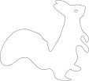
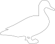
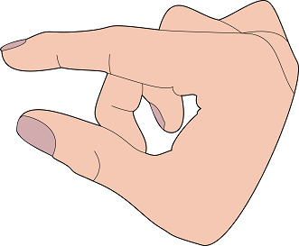

Rotoscopes as svg grafics
=========================

I use [inkscape](http://inkscape.org/download/?lang=de) to create them.

Examples:

License
------

  
These works are licensed under a [Creative Commons Attribution 4.0 International License](http://creativecommons.org/licenses/by/4.0/).

This means you can do whatever you want with it as long as you let others know it is from here or me.